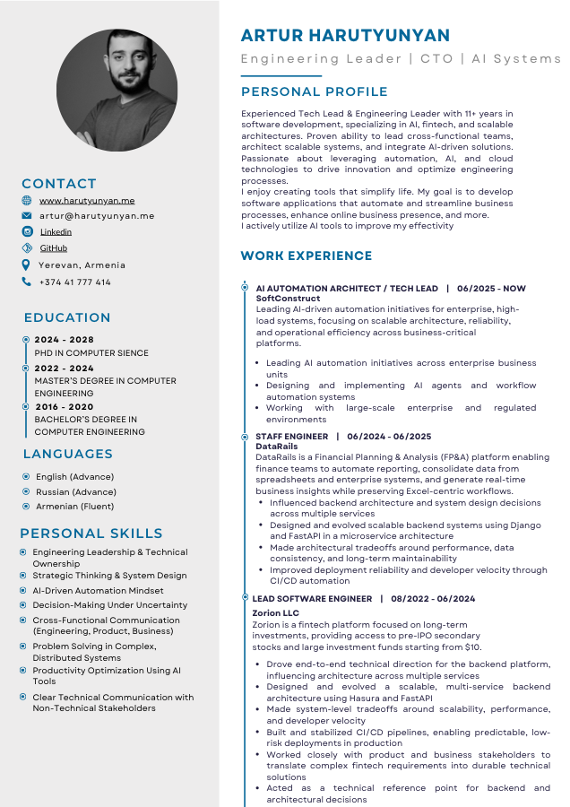

## CV

This folder contains a stable, repo-hosted CV link used by the profile README.

- **Canonical file**: `cv/Artur_Harutyunyan_CV.pdf`
- **Stable download URL (raw)**: `https://raw.githubusercontent.com/ArturHarutunyan/ArturHarutunyan/main/cv/Artur_Harutyunyan_CV.pdf`

### Quick preview

### TL;DR (what this repo keeps in sync)

- ✅ `cv/Artur_Harutyunyan_CV.pdf` (the real CV file)
- 🖼️ `cv/CV_preview.png` (thumbnail generated from page 1)

### Sync

If you enable the workflow in `.github/workflows/sync-cv.yml`, it will fetch your latest CV from `https://harutyunyan.me/CV.pdf` daily (and on manual trigger) and commit changes only when the PDF differs.

<!-- TODO: If the placeholder PDF is still present, trigger the workflow manually or upload your actual PDF once. -->

